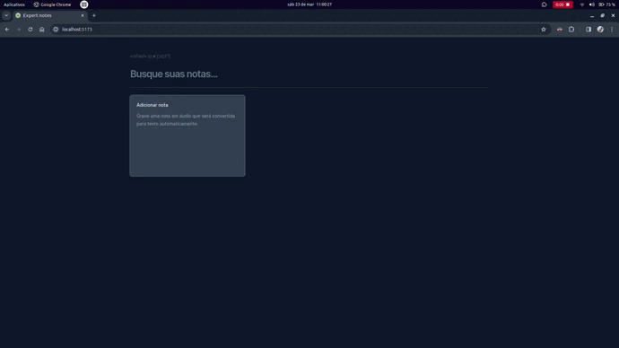

# Aplicativo de notas

Este é um aplicativo de notas onde é possível criar, pesquisar e excluir.



## Características

- Crie notas por texto texto
- Crie notas por voz
- Pesquise notas
- Excluir notas dos resultados da pesquisa

### Rodando o projeto

Clone o repositório e instale as dependências.
> Utilize `npm`, `pnpm`, `yarn` ou qualquer outro gerenciador de pacotes.

```sh
npm install
npm run dev
```

## Uso

### Criando Notas

Para criar uma nova nota de texto, clique no botão “Adicionar Nota” e escolha se quer usar por gravação de voz ou digitação

As notas são salvas após clicar em "Salvar nota".

### Pesquisando notas

Para pesquisar suas notas, digite uma consulta de pesquisa na barra de pesquisa. As notas correspondentes serão exibidas nos resultados.

### Excluindo notas

Para excluir uma nota abra a nota e clique em "Deseja apagar esta nota?".
